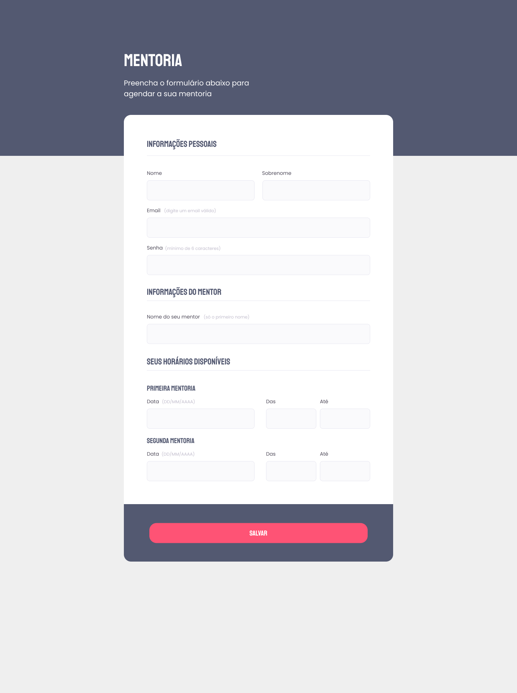

<h1 align="center"> Mentoria </h1>

Desafio proposto no Stage 03 do programa Explorer da Rocketseat, com o objetivo de reforçar os conceitos de formulários html. 

- Tag’s importantes como *Form*, *Fieldset*, *Legend*, *Textarea* foram abordadas, além de *pseudo-classes CSS* (*z-index*, *::after*, *::before*, *:hover*) e diferentes tipos de inputs *CSS* para personalização dos campos de resposta. 

 - [Acesse o projeto finalizado, online]()

  

 

  

## 🚀 Tecnologias

Esse projeto foi desenvolvido com as seguintes tecnologias:

- HTML e CSS
- Git e Github
- Figma

## 🔖 Layout

Você pode visualizar o layout do projeto através [DESSE LINK](https://www.figma.com/file/nKd6ei3dQplHnOlsMYnOFK/Explorer-Stage-03-Projeto-01-Copy?fuid=1267229948111116557). É necessário ter conta no [Figma](https://figma.com) para acessá-lo.

## :memo: Licença

Esse projeto está sob a licença MIT.

---

Feito com ♥ by Bernardo Sá :wave: [Participe da comunidade da Rocketseat!](https://discord.gg/rocketseat)